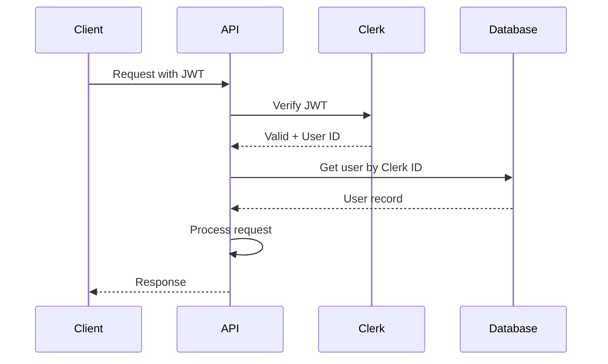

# Backend Architecture

## Service Architecture

### Traditional Server Architecture

#### Controller/Route Organization
```
api/
├── src/
│   ├── routes/
│   │   ├── auth.routes.ts
│   │   ├── briefs.routes.ts
│   │   ├── validations.routes.ts
│   │   └── personas.routes.ts
│   ├── controllers/
│   │   ├── briefs.controller.ts
│   │   └── validations.controller.ts
│   ├── services/
│   │   ├── briefs.service.ts
│   │   ├── validation.service.ts
│   │   └── adk-agent.service.ts
│   ├── middleware/
│   │   ├── auth.middleware.ts
│   │   ├── rate-limit.middleware.ts
│   │   └── error.middleware.ts
│   ├── repositories/
│   │   ├── brief.repository.ts
│   │   └── validation.repository.ts
│   └── app.ts
```

#### Controller Template
```typescript
import { Request, Response } from 'express';
import { BriefsService } from '../services/briefs.service';
import { validateRequest } from '../middleware/validation';

export class BriefsController {
  constructor(private briefsService: BriefsService) {}

  async create(req: Request, res: Response) {
    try {
      const userId = req.auth.userId;
      const brief = await this.briefsService.create({
        ...req.body,
        userId,
      });
      
      res.status(201).json(brief);
    } catch (error) {
      res.status(400).json({ 
        error: error.message 
      });
    }
  }

  async validate(req: Request, res: Response) {
    try {
      const { id } = req.params;
      const { personaId } = req.body;
      
      const job = await this.briefsService.startValidation(
        id, 
        personaId
      );
      
      res.status(202).json({
        validationId: job.id,
        status: 'processing',
        estimatedTime: 300
      });
    } catch (error) {
      res.status(400).json({ 
        error: error.message 
      });
    }
  }
}
```

## Database Architecture

### Schema Design
```typescript
// prisma/schema.prisma
generator client {
  provider = "prisma-client-js"
}

datasource db {
  provider = "postgresql"
  url      = env("DATABASE_URL")
}

model User {
  id           String   @id @default(uuid())
  clerkId      String   @unique
  email        String   @unique
  name         String
  organization String?
  role         Role     @default(USER)
  createdAt    DateTime @default(now())
  lastLoginAt  DateTime?
  
  featureBriefs FeatureBrief[]
}

model FeatureBrief {
  id                String    @id @default(uuid())
  userId            String
  title             String
  problemStatement  String
  proposedSolution  String
  targetUser        String
  hypothesis        String
  status           BriefStatus @default(DRAFT)
  createdAt        DateTime  @default(now())
  submittedAt      DateTime?
  updatedAt        DateTime  @updatedAt
  
  user             User      @relation(fields: [userId], references: [id])
  validationBrief  ValidationBrief?
}

model ValidationBrief {
  id                      String   @id @default(uuid())
  featureBriefId         String   @unique
  personaId              String
  perceivedValue         Int
  perceivedValueRationale String
  keyObjections          Json
  riskAssessment         Json
  adoptionBarriers       Json
  recommendedNextSteps   Json
  interviewTranscript    Json
  generatedAt            DateTime @default(now())
  exportedAt             DateTime?
  
  featureBrief           FeatureBrief @relation(fields: [featureBriefId], references: [id])
  persona                Persona      @relation(fields: [personaId], references: [id])
}

model Persona {
  id              String   @id
  name            String
  description     String
  role            String
  goals           Json
  painPoints      Json
  adkAgentConfig  Json
  isActive        Boolean  @default(true)
  
  validationBriefs ValidationBrief[]
}

enum Role {
  USER
  ADMIN
}

enum BriefStatus {
  DRAFT
  SUBMITTED
  VALIDATED
}
```

### Data Access Layer
```typescript
import { PrismaClient } from '@prisma/client';

export class BriefRepository {
  constructor(private prisma: PrismaClient) {}

  async create(data: CreateBriefDto) {
    return this.prisma.featureBrief.create({
      data,
      include: {
        user: true,
        validationBrief: true
      }
    });
  }

  async findByUserId(userId: string, status?: BriefStatus) {
    return this.prisma.featureBrief.findMany({
      where: {
        userId,
        ...(status && { status })
      },
      orderBy: { createdAt: 'desc' },
      include: {
        validationBrief: {
          select: {
            id: true,
            perceivedValue: true,
            generatedAt: true
          }
        }
      }
    });
  }

  async search(query: string, userId: string) {
    return this.prisma.$queryRaw`
      SELECT * FROM feature_briefs
      WHERE user_id = ${userId}
      AND to_tsvector('english', title || ' ' || problem_statement) 
      @@ plainto_tsquery('english', ${query})
      ORDER BY created_at DESC
      LIMIT 20
    `;
  }
}
```

## Authentication and Authorization

### Auth Flow


### Middleware/Guards
```typescript
import { Request, Response, NextFunction } from 'express';
import { clerkClient } from '@clerk/clerk-sdk-node';

export async function authMiddleware(
  req: Request, 
  res: Response, 
  next: NextFunction
) {
  try {
    const token = req.headers.authorization?.split(' ')[1];
    
    if (!token) {
      return res.status(401).json({ 
        error: 'No token provided' 
      });
    }
    
    const session = await clerkClient.sessions.verifySession(
      '', 
      token
    );
    
    if (!session) {
      return res.status(401).json({ 
        error: 'Invalid token' 
      });
    }
    
    req.auth = {
      userId: session.userId,
      sessionId: session.id
    };
    
    next();
  } catch (error) {
    res.status(401).json({ 
      error: 'Authentication failed' 
    });
  }
}

// Rate limiting middleware
import rateLimit from 'express-rate-limit';

export const apiLimiter = rateLimit({
  windowMs: 60 * 1000, // 1 minute
  max: 100, // 100 requests per minute
  message: 'Too many requests, please try again later'
});

export const validationLimiter = rateLimit({
  windowMs: 60 * 60 * 1000, // 1 hour
  max: 10, // 10 validations per hour
  keyGenerator: (req) => req.auth?.userId || req.ip,
  message: 'Validation limit reached. Please try again later.'
});
```
