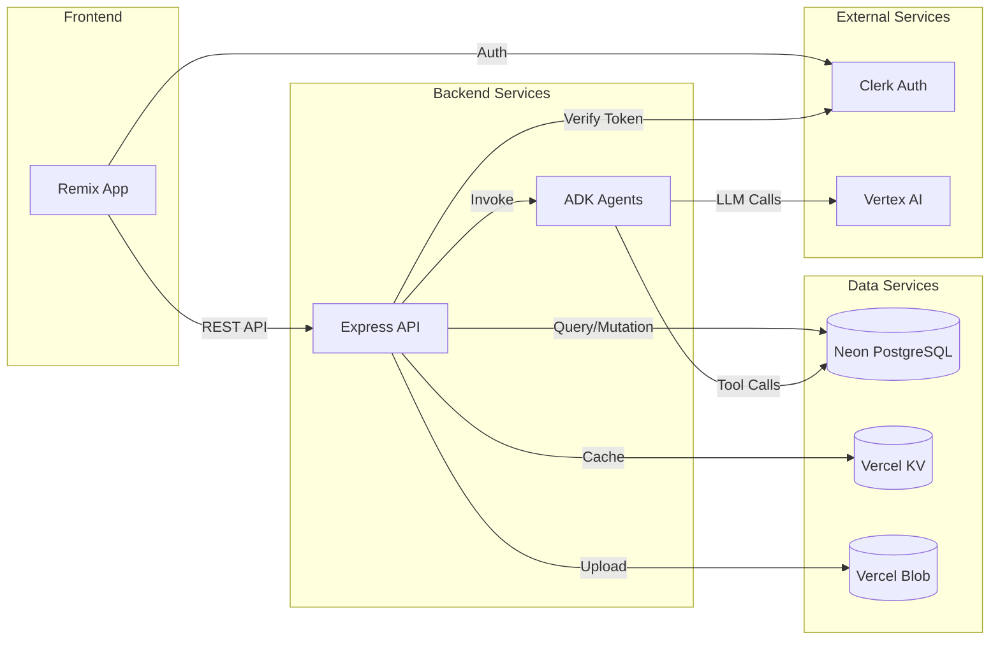

# Components

## Web Frontend (Remix App)
**Responsibility:** Server-side rendered React application providing the user interface for product managers to create feature briefs, trigger validations, and review results

**Key Interfaces:**
- HTTP requests to Express API via fetch
- Clerk SDK for authentication
- Form actions for brief submission
- WebSocket connection for real-time validation progress

**Dependencies:** Express API, Clerk Auth, Vercel KV

**Technology Stack:** Remix 2.5+, React 18+, TypeScript, Radix UI, Tailwind CSS

## API Service (Express Backend)
**Responsibility:** RESTful API service orchestrating business logic, database operations, and AI agent interactions

**Key Interfaces:**
- REST endpoints as defined in OpenAPI spec
- PostgreSQL queries via Prisma ORM
- ADK agent invocation for persona interviews
- Vercel KV for session caching

**Dependencies:** Neon PostgreSQL, Google ADK, Vercel KV, Clerk Auth

**Technology Stack:** Express 4.18+, TypeScript, Prisma ORM, Google ADK SDK

## ADK Agent Service
**Responsibility:** Manages AI persona agents that conduct structured interviews with feature briefs

**Key Interfaces:**
- Agent initialization with persona configs
- Tool registration for database access
- Structured interview execution
- Response formatting and scoring

**Dependencies:** Google Vertex AI, PostgreSQL (via tools)

**Technology Stack:** Google ADK, Gemini 2.5 Pro, TypeScript

## Database Layer (Neon PostgreSQL)
**Responsibility:** Persistent storage for all application data with JSONB support for flexible AI responses

**Key Interfaces:**
- Prisma schema and migrations
- Connection pooling via Neon
- Read replicas for search queries
- Database branching for testing

**Dependencies:** None (leaf component)

**Technology Stack:** PostgreSQL 16+, Prisma ORM, Neon branching

## Authentication Service (Clerk)
**Responsibility:** Complete authentication and user management solution

**Key Interfaces:**
- JWT token generation and validation
- User profile management
- Session management
- OAuth providers

**Dependencies:** None (external service)

**Technology Stack:** Clerk SDK, JWT tokens, OAuth 2.0

## Session Cache (Vercel KV)
**Responsibility:** Redis-compatible caching for user sessions and temporary data

**Key Interfaces:**
- Key-value operations
- TTL management
- Session storage
- Rate limiting counters

**Dependencies:** None (managed service)

**Technology Stack:** Vercel KV (Redis protocol)

## File Storage (Vercel Blob)
**Responsibility:** Store generated PDF and markdown exports

**Key Interfaces:**
- Blob upload API
- Signed URL generation
- Automatic expiry
- CDN distribution

**Dependencies:** None (managed service)

**Technology Stack:** Vercel Blob Storage

## Component Interaction Diagram

