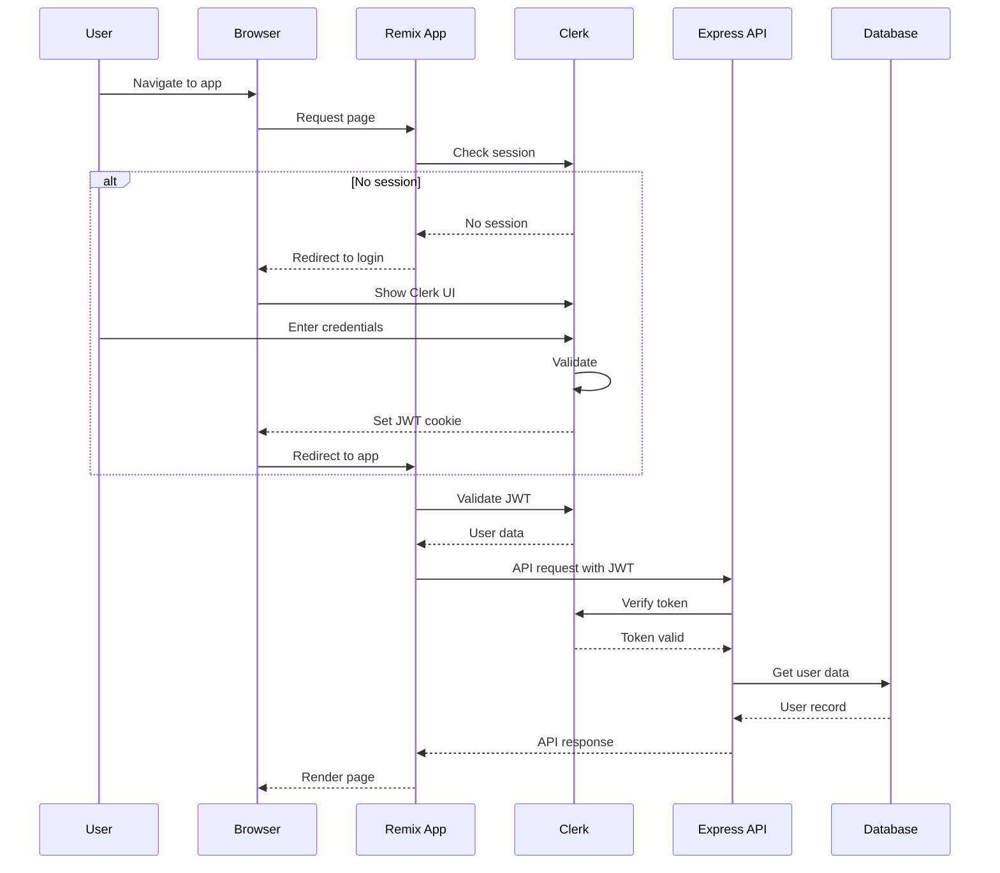
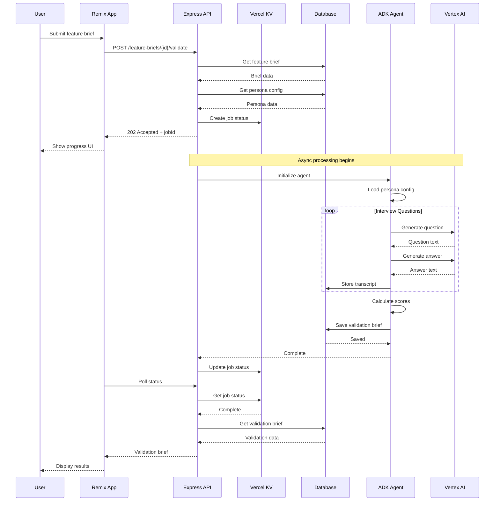
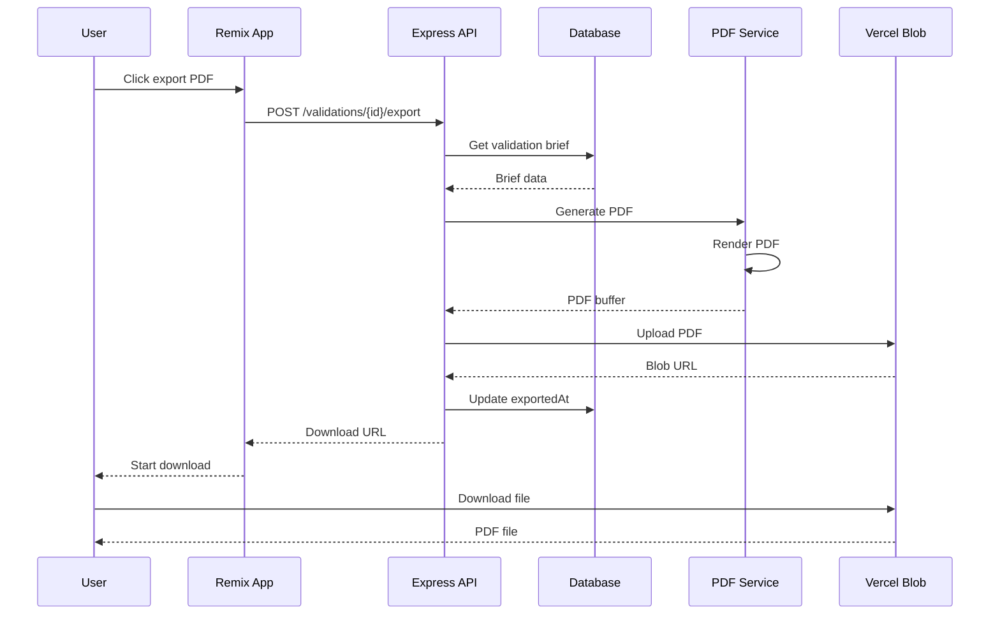
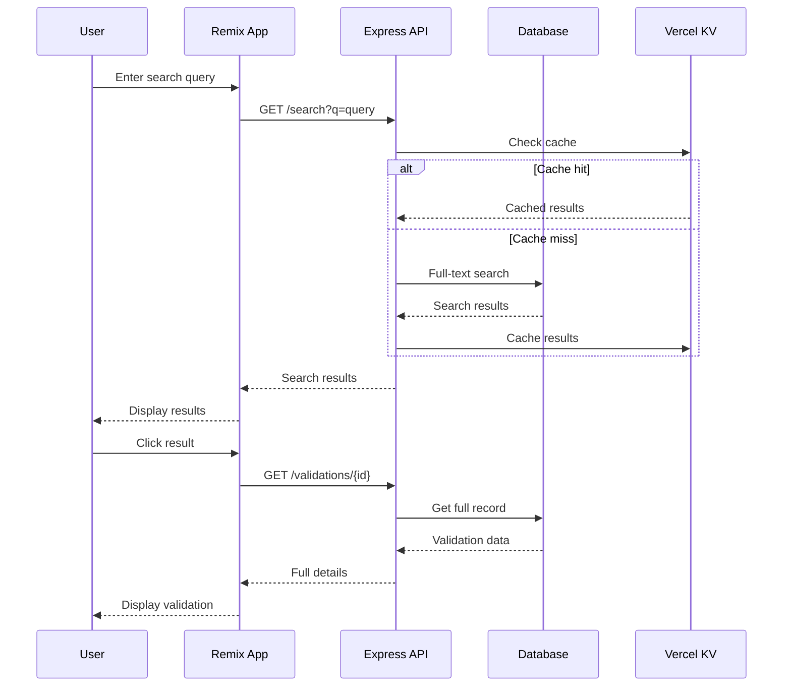
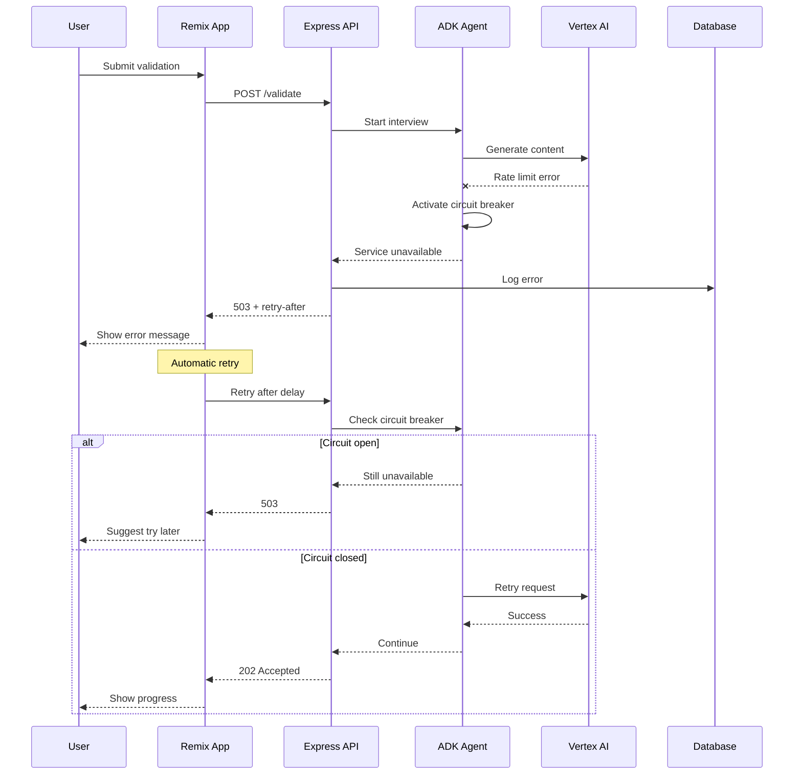

# Core Workflows

## User Authentication Flow

```mermaid
sequenceDiagram
    participant U as User
    participant B as Browser
    participant R as Remix App
    participant C as Clerk
    participant A as Express API
    participant D as Database

    U->>B: Navigate to app
    B->>R: Request page
    R->>C: Check session
    alt No session
        C-->>R: No session
        R-->>B: Redirect to login
        B->>C: Show Clerk UI
        U->>C: Enter credentials
        C->>C: Validate
        C-->>B: Set JWT cookie
        B->>R: Redirect to app
    end
    R->>C: Validate JWT
    C-->>R: User data
    R->>A: API request with JWT
    A->>C: Verify token
    C-->>A: Token valid
    A->>D: Get user data
    D-->>A: User record
    A-->>R: API response
    R-->>B: Render page
```

## Feature Brief Validation Flow

```mermaid
sequenceDiagram
    participant U as User
    participant R as Remix App
    participant A as Express API
    participant K as Vercel KV
    participant D as Database
    participant ADK as ADK Agent
    participant V as Vertex AI

    U->>R: Submit feature brief
    R->>A: POST /feature-briefs/{id}/validate
    A->>D: Get feature brief
    D-->>A: Brief data
    A->>D: Get persona config
    D-->>A: Persona data
    A->>K: Create job status
    A-->>R: 202 Accepted + jobId
    R-->>U: Show progress UI
    
    Note over A,V: Async processing begins
    
    A->>ADK: Initialize agent
    ADK->>ADK: Load persona config
    
    loop Interview Questions
        ADK->>V: Generate question
        V-->>ADK: Question text
        ADK->>V: Generate answer
        V-->>ADK: Answer text
        ADK->>D: Store transcript
    end
    
    ADK->>ADK: Calculate scores
    ADK->>D: Save validation brief
    D-->>ADK: Saved
    ADK-->>A: Complete
    A->>K: Update job status
    
    R->>A: Poll status
    A->>K: Get job status
    K-->>A: Complete
    A->>D: Get validation brief
    D-->>A: Validation data
    A-->>R: Validation brief
    R-->>U: Display results
```

## Export Validation Brief Flow

```mermaid
sequenceDiagram
    participant U as User
    participant R as Remix App
    participant A as Express API
    participant D as Database
    participant P as PDF Service
    participant B as Vercel Blob

    U->>R: Click export PDF
    R->>A: POST /validations/{id}/export
    A->>D: Get validation brief
    D-->>A: Brief data
    A->>P: Generate PDF
    P->>P: Render PDF
    P-->>A: PDF buffer
    A->>B: Upload PDF
    B-->>A: Blob URL
    A->>D: Update exportedAt
    A-->>R: Download URL
    R-->>U: Start download
    U->>B: Download file
    B-->>U: PDF file
```

## Search History Flow

```mermaid
sequenceDiagram
    participant U as User
    participant R as Remix App
    participant A as Express API
    participant D as Database
    participant K as Vercel KV

    U->>R: Enter search query
    R->>A: GET /search?q=query
    A->>K: Check cache
    alt Cache hit
        K-->>A: Cached results
    else Cache miss
        A->>D: Full-text search
        D-->>A: Search results
        A->>K: Cache results
    end
    A-->>R: Search results
    R-->>U: Display results
    
    U->>R: Click result
    R->>A: GET /validations/{id}
    A->>D: Get full record
    D-->>A: Validation data
    A-->>R: Full details
    R-->>U: Display validation
```

## Error Handling Flow

```mermaid
sequenceDiagram
    participant U as User
    participant R as Remix App
    participant A as Express API
    participant ADK as ADK Agent
    participant V as Vertex AI
    participant D as Database

    U->>R: Submit validation
    R->>A: POST /validate
    A->>ADK: Start interview
    ADK->>V: Generate content
    V--xADK: Rate limit error
    
    ADK->>ADK: Activate circuit breaker
    ADK-->>A: Service unavailable
    A->>D: Log error
    A-->>R: 503 + retry-after
    R-->>U: Show error message
    
    Note over R: Automatic retry
    R->>A: Retry after delay
    A->>ADK: Check circuit breaker
    alt Circuit open
        ADK-->>A: Still unavailable
        A-->>R: 503
        R-->>U: Suggest try later
    else Circuit closed
        ADK->>V: Retry request
        V-->>ADK: Success
        ADK-->>A: Continue
        A-->>R: 202 Accepted
        R-->>U: Show progress
    end
```
