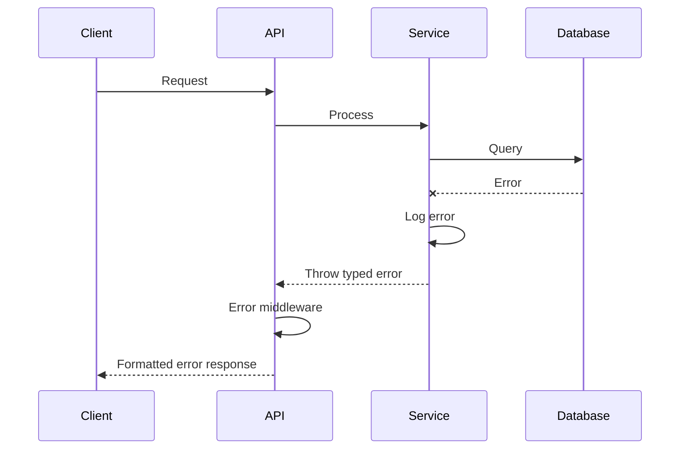

# Error Handling Strategy

## Error Flow


## Error Response Format
```typescript
interface ApiError {
  error: {
    code: string;
    message: string;
    details?: Record<string, any>;
    timestamp: string;
    requestId: string;
  };
}
```

## Frontend Error Handling
```typescript
export function ErrorBoundary({ error }: { error: Error }) {
  if (error instanceof ApiError) {
    return (
      <div className="error-container">
        <h2>Something went wrong</h2>
        <p>{error.message}</p>
        <button onClick={() => window.location.reload()}>
          Try again
        </button>
      </div>
    );
  }
  
  throw error; // Re-throw to parent boundary
}
```

## Backend Error Handling
```typescript
export class AppError extends Error {
  constructor(
    public statusCode: number,
    public code: string,
    message: string,
    public details?: any
  ) {
    super(message);
  }
}

export function errorHandler(
  err: Error,
  req: Request,
  res: Response,
  next: NextFunction
) {
  if (err instanceof AppError) {
    return res.status(err.statusCode).json({
      error: {
        code: err.code,
        message: err.message,
        details: err.details,
        timestamp: new Date().toISOString(),
        requestId: req.id
      }
    });
  }
  
  // Generic error
  res.status(500).json({
    error: {
      code: 'INTERNAL_ERROR',
      message: 'An unexpected error occurred',
      timestamp: new Date().toISOString(),
      requestId: req.id
    }
  });
}
```
