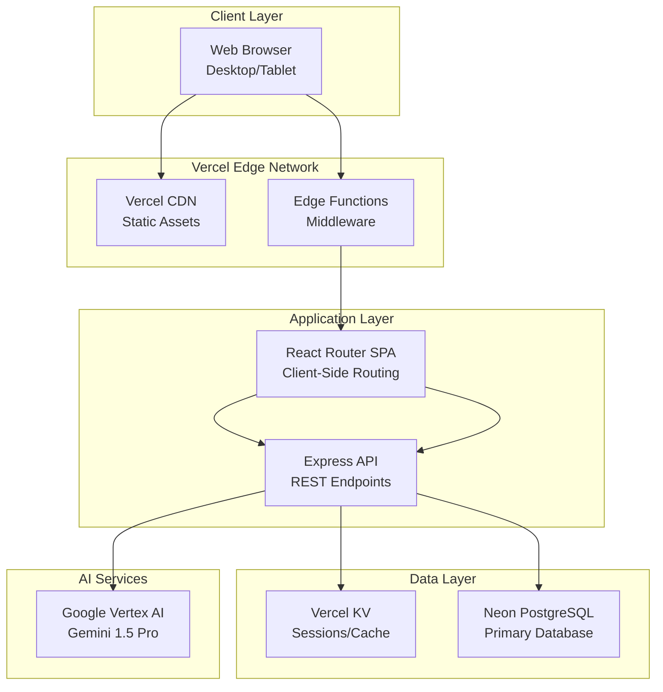

# High Level Architecture

## Technical Summary

The Compass employs a modern fullstack architecture with React Router v7 following the default template structure, providing both client and server-side rendering capabilities. The frontend uses the standard `app/` directory structure with file-based routing in `app/routes/`, paired with an Express.js backend API that orchestrates AI persona agents built with Google's Agent Development Kit (ADK). The system deploys to Vercel with the frontend as a React Router app and the backend API as serverless functions, leveraging Vercel KV for session management. Neon provides a serverless PostgreSQL database with automatic scaling and branching capabilities, while the ADK agents powered by Gemini 1.5 Pro conduct structured persona interviews. This architecture prioritizes rapid development velocity and operational simplicity while maintaining clear module boundaries for future scaling.

## Platform and Infrastructure Choice

**Platform:** Vercel  
**Key Services:** Vercel Hosting, Vercel KV (Redis), Vercel Edge Functions, Neon (Serverless PostgreSQL), Google Vertex AI, Google Agent Development Kit (ADK)  
**Deployment Host and Regions:** Vercel Global Edge Network (Primary: US-East)

## Repository Structure

**Structure:** Monorepo  
**Monorepo Tool:** npm workspaces (built-in, no additional tooling overhead)  
**Package Organization:** Apps (web, api) + Shared packages (types, utils, config)

## High Level Architecture Diagram

## Architectural Patterns

- **Single-Page Application (SPA):** React Router for client-side routing with static hosting - _Rationale:_ Optimal performance for interactive PM tools, simplified deployment, better developer experience
- **Static Hosting with API Backend:** Decoupled frontend served from CDN with separate API - _Rationale:_ Independent scaling, faster iterations, and optimal caching strategies
- **Feature-Oriented Modules:** Organize code by feature rather than technical layer - _Rationale:_ Improved developer experience and easier feature iteration
- **Repository Pattern:** Abstract PostgreSQL operations behind clean interfaces - _Rationale:_ Testability and potential future database migration flexibility
- **Agent-Based Architecture:** ADK agents encapsulate persona behaviors and interview logic - _Rationale:_ Modular, maintainable AI personas with consistent behavior and easy testing
- **Tool-Augmented Agents:** ADK agents use tools for data access and external operations - _Rationale:_ Separation of concerns between agent logic and system integration
- **Circuit Breaker Pattern:** Graceful degradation for Vertex AI calls - _Rationale:_ System resilience when AI services are unavailable or rate-limited
- **Database Branching:** Leverage Neon's branching for safe migrations and testing - _Rationale:_ Risk-free database changes and instant rollback capability
