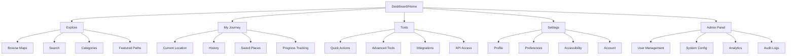
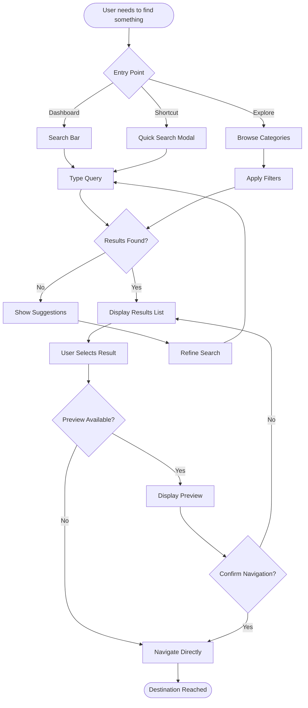

# The Compass UI/UX Specification

## Introduction

This document defines the user experience goals, information architecture, user flows, and visual design specifications for The Compass's user interface. It serves as the foundation for visual design and frontend development, ensuring a cohesive and user-centered experience.

### Overall UX Goals & Principles

#### Target User Personas

**Power User:** Technical professionals who need advanced features and efficiency
- Comfortable with complex interfaces and keyboard shortcuts
- Values customization and control over simplicity
- Expects comprehensive functionality and API access

**Casual User:** Occasional users who prioritize ease of use and clear guidance
- Needs intuitive navigation and self-explanatory interfaces
- May return after long periods without relearning
- Values clear visual hierarchy and helpful tooltips

**Administrator:** System managers who need control and oversight capabilities
- Requires dashboard views and system monitoring
- Needs bulk operations and configuration management
- Values security features and audit trails

#### Usability Goals

- **Ease of learning:** New users can complete core tasks within 5 minutes
- **Efficiency of use:** Power users can complete frequent tasks with minimal clicks
- **Error prevention:** Clear validation and confirmation for destructive actions
- **Memorability:** Infrequent users can return without relearning
- **Satisfaction:** 80%+ task completion rate without external help

#### Design Principles

1. **Clarity over cleverness** - Prioritize clear communication over aesthetic innovation
2. **Progressive disclosure** - Show only what's needed, when it's needed
3. **Consistent patterns** - Use familiar UI patterns throughout the application
4. **Immediate feedback** - Every action should have a clear, immediate response
5. **Accessible by default** - Design for all users from the start (WCAG 2.1 AA compliance)

### Change Log

| Date | Version | Description | Author |
|------|---------|-------------|--------|
| 2025-09-04 | 1.0 | Initial document creation | Sally (UX Expert) |

## Information Architecture (IA)

### Site Map / Screen Inventory



### Navigation Structure

**Primary Navigation:** Persistent navigation bar with core sections - Dashboard, Explore, My Journey, Tools, Settings. Admin Panel visible only to administrators.

**Secondary Navigation:** Contextual sub-navigation appears within each primary section, using tabs or sidebar depending on content density.

**Breadcrumb Strategy:** Full hierarchical path from Dashboard, with collapsible segments on mobile devices to preserve screen space.

## User Flows

### Search and Navigate Flow

**User Goal:** Find and navigate to a specific destination or information

**Entry Points:** 
- Dashboard search bar
- Explore section
- Quick action shortcut (Cmd/Ctrl + K)
- Voice command (if supported)

**Success Criteria:** User finds desired destination and understands how to proceed within 30 seconds

#### Flow Diagram



#### Edge Cases & Error Handling:
- Empty search: Show recent/popular destinations
- Ambiguous results: Provide disambiguation options
- No results: Suggest similar terms, check spelling
- Network failure: Show cached results with indicator
- Access denied: Clear messaging about permissions needed

**Notes:** Consider implementing smart sorting based on user's previous selections and role-based result prioritization.

## Wireframes & Mockups

**Primary Design Files:** [Figma/Sketch/Adobe XD link to be added]

### Key Screen Layouts

#### Dashboard/Home Screen
**Purpose:** Central hub providing overview and quick access to all major functions

**Key Elements:**
- Global search bar (prominent, center or top)
- Quick stats/status widgets (customizable by user role)
- Recent activity feed
- Quick action buttons for common tasks
- Navigation menu (persistent)

**Interaction Notes:** Dashboard should load quickly with progressive enhancement. Power users can customize widget layout, casual users get smart defaults.

**Design File Reference:** [Link to Dashboard screens in design file]

#### Search Results Screen
**Purpose:** Display and filter search results effectively for different content types

**Key Elements:**
- Search refinement bar with filters
- Results list/grid with preview cards
- Sorting options (relevance, recent, popular)
- Pagination or infinite scroll
- Quick actions per result item

**Interaction Notes:** Results appear instantly with loading states. Filters apply without page refresh. Preview on hover for desktop, tap to preview on mobile.

**Design File Reference:** [Link to Search screens in design file]

#### Admin Panel Dashboard
**Purpose:** Provide administrators with system oversight and management tools

**Key Elements:**
- System health indicators
- User activity metrics
- Quick admin actions panel
- Recent system events log
- Configuration shortcuts

**Interaction Notes:** Real-time updates for critical metrics. Drill-down capability for all widgets. Role-based visibility of admin features.

**Design File Reference:** [Link to Admin screens in design file]

## Component Library / Design System

**Design System Approach:** Tailwind CSS-based component system with custom utility classes and component patterns. Leverage Tailwind's utility-first approach for rapid development while maintaining consistency through component abstractions and custom configuration.

### Core Components

#### Search Input Component
**Purpose:** Universal search interface used across all entry points

**Variants:** 
- Default (standard search bar)
- Compact (header/toolbar version)
- Enhanced (with filters and suggestions)
- Voice-enabled (with microphone icon)

**States:** Default, Focused, Loading, Error, Disabled

**Usage Guidelines:** Always include placeholder text relevant to context. Show recent searches on focus for returning users. Implement type-ahead after 2 characters.

**Tailwind Implementation Notes:**
- Use `@apply` directive for reusable search input styles
- Leverage `focus:` and `hover:` variants for interactive states
- Custom colors defined in `tailwind.config.js` for brand consistency
- Example classes: `rounded-lg border-gray-300 focus:ring-2 focus:ring-primary-500`

#### Navigation Card Component
**Purpose:** Display navigation destinations and results in a scannable format

**Variants:**
- Grid card (image + title + description)
- List item (compact horizontal layout)
- Featured card (larger with more details)
- Mini card (icon + title only)

**States:** Default, Hover, Selected, Loading, Disabled, Locked (permissions)

**Usage Guidelines:** Include visual hierarchy with primary action prominent. Always show feedback on interaction. Ensure touch targets meet 44x44px minimum.

**Tailwind Implementation Notes:**
- Use CSS Grid with Tailwind's `grid` utilities for responsive layouts
- Implement hover effects with `transition-all duration-200 hover:shadow-lg`
- Create card variants using component classes like `.card-grid`, `.card-list`
- Maintain consistency with spacing utilities: `p-4 sm:p-6`

#### Status Indicator Component
**Purpose:** Communicate system state and user progress

**Variants:**
- Badge (numeric or dot)
- Progress bar (linear or circular)
- Status chip (with icon and text)
- Alert banner (full-width messaging)

**States:** Success, Warning, Error, Info, Neutral, Loading

**Usage Guidelines:** Use consistent color coding across all variants. Include accessible text alternatives. Avoid overwhelming users with too many indicators.

**Tailwind Implementation Notes:**
- Define semantic color utilities in config: `success-500`, `warning-500`, `error-500`
- Use `animate-pulse` for loading states
- Badge example: `inline-flex items-center px-2 py-1 text-xs font-medium rounded-full`
- Ensure color contrast with Tailwind's color palette

#### Action Button Component
**Purpose:** Trigger user actions consistently across the interface

**Variants:**
- Primary (main actions)
- Secondary (supporting actions)
- Text (low-emphasis actions)
- Floating Action Button (FAB for mobile)
- Icon button (toolbar actions)

**States:** Default, Hover, Active, Loading, Disabled

**Usage Guidelines:** Limit primary buttons to 1-2 per screen. Include loading states for async actions. Ensure contrast ratios meet WCAG AA standards.

**Tailwind Implementation Notes:**
- Base button: `px-4 py-2 font-medium rounded-md transition-colors duration-200`
- Primary: `bg-primary-600 text-white hover:bg-primary-700 focus:ring-2 focus:ring-offset-2`
- Disabled state: `disabled:opacity-50 disabled:cursor-not-allowed`
- Loading state with spinner: `relative` with absolutely positioned spinner

### Tailwind Configuration Strategy

**Custom Extensions:**
```javascript
// tailwind.config.js key extensions
- Custom color palette matching brand
- Additional spacing scale for consistent component sizing
- Custom animation utilities for micro-interactions
- Font family definitions for typography system
- Custom breakpoints if needed for responsive design
```

**Component Class Strategy:**
- Use `@layer components` for complex, reusable patterns
- Maintain a balance between utility classes and component abstractions
- Document component patterns in Storybook or similar tool
- Create Tailwind plugins for complex interactive states

## Branding & Style Guide

### Visual Identity

**Brand Guidelines:** [Link to brand assets and guidelines document]

### Color Palette

| Color Type | Hex Code | Tailwind Config | Usage |
|------------|----------|-----------------|--------|
| Primary | #2563EB | primary-500 (blue-600) | Primary actions, active states, links |
| Secondary | #7C3AED | secondary-500 (violet-600) | Secondary actions, accents |
| Accent | #06B6D4 | accent-500 (cyan-500) | Highlights, notifications |
| Success | #10B981 | success-500 (emerald-500) | Positive feedback, confirmations |
| Warning | #F59E0B | warning-500 (amber-500) | Cautions, important notices |
| Error | #EF4444 | error-500 (red-500) | Errors, destructive actions |
| Neutral | #6B7280 | gray-500 | Text, borders, backgrounds |

**Tailwind Color Extension:**
```javascript
// tailwind.config.js
colors: {
  primary: colors.blue,
  secondary: colors.violet,
  accent: colors.cyan,
  success: colors.emerald,
  warning: colors.amber,
  error: colors.red,
  // Maintain full scale for each semantic color
}
```

### Typography

#### Font Families
- **Primary:** Inter, system-ui, sans-serif (optimized for readability)
- **Secondary:** Inter, system-ui, sans-serif (same for consistency)
- **Monospace:** 'Fira Code', 'Courier New', monospace (for code/data)

#### Type Scale

| Element | Size | Weight | Line Height | Tailwind Class |
|---------|------|--------|-------------|----------------|
| H1 | 36px | 700 | 1.2 | text-4xl font-bold leading-tight |
| H2 | 30px | 600 | 1.3 | text-3xl font-semibold leading-tight |
| H3 | 24px | 600 | 1.4 | text-2xl font-semibold leading-normal |
| Body | 16px | 400 | 1.5 | text-base font-normal leading-relaxed |
| Small | 14px | 400 | 1.4 | text-sm font-normal leading-normal |

### Iconography

**Icon Library:** Heroicons (designed for Tailwind) or Lucide icons

**Usage Guidelines:** 
- Use outline icons for navigation and actions
- Use solid icons for states and emphasis
- Maintain consistent 24px size for standard icons
- Support 20px for inline, 16px for small contexts

**Tailwind Implementation:**
```html
<!-- Example icon usage -->
<svg class="h-6 w-6 text-gray-500 hover:text-primary-600">
```

### Spacing & Layout

**Grid System:** 12-column grid using CSS Grid or Flexbox
- Mobile: 1 column
- Tablet: 6-8 columns
- Desktop: 12 columns

**Spacing Scale:** Tailwind default with custom additions
```javascript
// Extend spacing for specific needs
spacing: {
  '18': '4.5rem',
  '88': '22rem',
  '128': '32rem',
}
```

**Container Widths:**
- Max width: 1280px (`max-w-7xl`)
- Content width: 1024px (`max-w-6xl`)
- Reading width: 768px (`max-w-3xl`)

**Common Spacing Patterns:**
- Page padding: `px-4 sm:px-6 lg:px-8`
- Section spacing: `py-12 sm:py-16 lg:py-20`
- Component spacing: `space-y-4` or `gap-4` for flex/grid
- Card padding: `p-4 sm:p-6`

## Accessibility Requirements

### Compliance Target

**Standard:** WCAG 2.1 Level AA compliance with selected AAA criteria for critical user paths

### Key Requirements

**Visual:**
- Color contrast ratios: 4.5:1 for normal text, 3:1 for large text (AA standard)
- Focus indicators: Visible focus rings on all interactive elements using Tailwind's `focus-visible:` utilities
- Text sizing: Base font 16px minimum, user scalable to 200% without horizontal scroll

**Interaction:**
- Keyboard navigation: All functionality accessible via keyboard, logical tab order throughout
- Screen reader support: Semantic HTML, ARIA labels where needed, live regions for dynamic content
- Touch targets: Minimum 44x44px for mobile, proper spacing between interactive elements

**Content:**
- Alternative text: Descriptive alt text for all informative images, empty alt="" for decorative
- Heading structure: Logical H1-H6 hierarchy, one H1 per page, no skipped levels
- Form labels: Explicit labels for all inputs, error messages linked via aria-describedby

### Testing Strategy

- Automated testing with axe-core integrated in CI/CD pipeline
- Manual keyboard navigation testing for all new features
- Screen reader testing with NVDA (Windows) and VoiceOver (Mac/iOS)
- Color contrast validation using Tailwind's built-in palette ensures compliance
- Regular audits using Lighthouse and WAVE tools

**Tailwind Accessibility Utilities:**
```css
/* Example accessible component patterns */
.sr-only /* Screen reader only content */
.not-sr-only /* Reveal screen reader content */
.focus-visible:ring-2 /* Keyboard focus indicators */
.focus-visible:ring-offset-2 /* Focus ring spacing */
```

## Responsiveness Strategy

### Breakpoints

| Breakpoint | Min Width | Max Width | Target Devices | Tailwind Prefix |
|------------|-----------|-----------|----------------|-----------------|
| Mobile | 0px | 639px | Phones, small devices | (default) |
| Tablet | 640px | 1023px | Tablets, small laptops | sm: |
| Desktop | 1024px | 1279px | Laptops, desktops | lg: |
| Wide | 1280px | - | Large monitors, TVs | xl: |

### Adaptation Patterns

**Layout Changes:** 
- Mobile: Single column, stacked navigation, full-width components
- Tablet: 2-column layouts, sidebar navigation appears
- Desktop: Multi-column grids, persistent sidebars, modal overlays
- Example: `grid-cols-1 sm:grid-cols-2 lg:grid-cols-3 xl:grid-cols-4`

**Navigation Changes:**
- Mobile: Hamburger menu with slide-out drawer
- Tablet: Bottom tab bar or collapsible sidebar
- Desktop: Persistent top navigation with dropdowns
- Implementation: `hidden sm:block` for desktop nav, `sm:hidden` for mobile menu

**Content Priority:**
- Mobile: Core content only, progressive disclosure for details
- Tablet: Secondary information visible, side panels introduced
- Desktop: Full information density, multiple panels visible
- Use `hidden sm:block lg:flex` patterns for progressive reveal

**Interaction Changes:**
- Mobile: Touch-optimized with swipe gestures, larger tap targets
- Tablet: Mixed touch/mouse, hover states on capable devices
- Desktop: Full hover interactions, keyboard shortcuts enabled
- Tailwind: `hover:` effects with `@media (hover: hover)` for touch safety

**Common Responsive Patterns:**
```html
<!-- Responsive padding -->
<div class="p-4 sm:p-6 lg:p-8">

<!-- Responsive text -->
<h1 class="text-2xl sm:text-3xl lg:text-4xl">

<!-- Responsive grid -->
<div class="grid grid-cols-1 sm:grid-cols-2 lg:grid-cols-3 gap-4">

<!-- Responsive visibility -->
<span class="hidden sm:inline">Desktop only</span>
<span class="sm:hidden">Mobile only</span>
```

## Animation & Micro-interactions

### Motion Principles

1. **Purposeful:** Every animation serves a function - feedback, guidance, or continuity
2. **Fast & Subtle:** 200-300ms for most transitions, 400ms maximum for complex animations
3. **Natural Easing:** Use ease-out for entrances, ease-in for exits, ease-in-out for movements
4. **Consistent:** Same elements always animate the same way
5. **Respectful:** Honor user's motion preferences with `motion-reduce:` utilities

### Key Animations

- **Button Press:** Scale down slightly on click (Duration: 150ms, Easing: ease-out)
  - Tailwind: `active:scale-95 transition-transform duration-150`

- **Card Hover:** Subtle shadow elevation and slight y-axis shift (Duration: 200ms, Easing: ease-out)
  - Tailwind: `hover:-translate-y-0.5 hover:shadow-lg transition-all duration-200`

- **Loading States:** Skeleton screens with pulse animation (Duration: 2s, Easing: ease-in-out)
  - Tailwind: `animate-pulse bg-gradient-to-r from-gray-200 via-gray-300 to-gray-200`

- **Page Transitions:** Fade and slide for route changes (Duration: 300ms, Easing: ease-in-out)
  - Tailwind: `transition-opacity duration-300` with transform utilities

- **Modal Appearance:** Fade backdrop, scale modal from 95% to 100% (Duration: 200ms, Easing: ease-out)
  - Tailwind: `transition-all transform scale-95 opacity-0` to `scale-100 opacity-100`

- **Success Feedback:** Brief color flash or checkmark appearance (Duration: 400ms, Easing: ease-out)
  - Custom animation in Tailwind config for complex sequences

**Tailwind Animation Config:**
```javascript
// tailwind.config.js
animation: {
  'fade-in': 'fadeIn 200ms ease-out',
  'slide-up': 'slideUp 300ms ease-out',
  'bounce-light': 'bounce 1s ease-in-out 2',
}
```

**Motion Accessibility:**
```css
/* Respect user preferences */
@media (prefers-reduced-motion: reduce) {
  *, *::before, *::after {
    animation-duration: 0.01ms !important;
    transition-duration: 0.01ms !important;
  }
}
```

## Performance Considerations

### Performance Goals

- **Page Load:** Initial load under 3 seconds on 3G, under 1 second on broadband
- **Interaction Response:** User input acknowledged within 100ms
- **Animation FPS:** Maintain 60 FPS for all animations

### Design Strategies

- **Image Optimization:** Use WebP format with fallbacks, implement lazy loading with Intersection Observer
- **Code Splitting:** Leverage dynamic imports for route-based splitting, load heavy components on demand
- **CSS Optimization:** Purge unused Tailwind classes in production, minimize custom CSS
- **Font Loading:** Use font-display: swap, preload critical fonts, subset fonts for required characters
- **Caching Strategy:** Implement service workers for offline capability, use browser caching for static assets
- **Performance Monitoring:** Track Core Web Vitals (LCP, FID, CLS), set up performance budgets in CI/CD

## Next Steps

### Immediate Actions

1. Review this specification with stakeholders for alignment
2. Create or update visual designs in Figma/Sketch based on this specification
3. Set up Tailwind configuration file with custom theme values
4. Build component library with Storybook for documentation
5. Conduct accessibility audit of proposed designs
6. Prepare handoff to development team with Design Architect

### Design Handoff Checklist

- [x] All user flows documented
- [x] Component inventory complete
- [x] Accessibility requirements defined
- [x] Responsive strategy clear
- [x] Brand guidelines incorporated
- [x] Performance goals established

## Checklist Results

*UI/UX checklist to be run against this document upon completion*